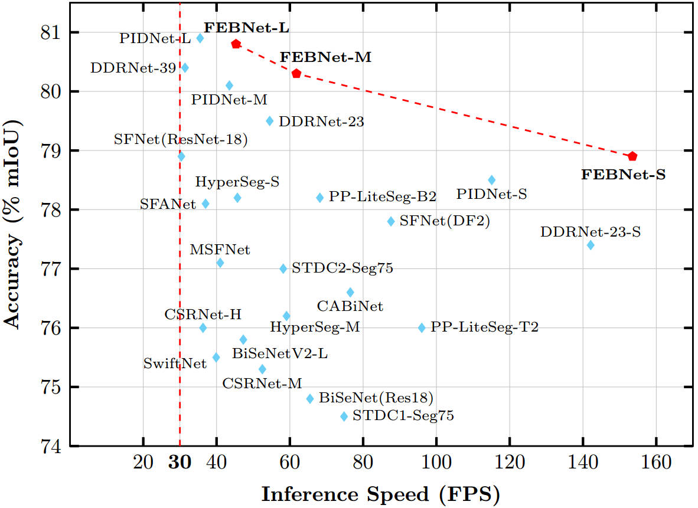
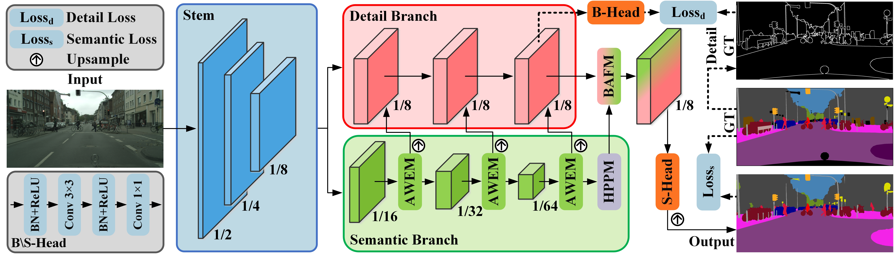

# FEBNet: Frequency-Enhanced Bilateral Network for Efficient Semantic Segmentation
	

This is the official repository for our recent work: FEBNet

## Highlights

   
  The trade-off between inference speed (FPS) and segmentation accuracy (mIoU) for real-time models on the Cityscapes validation set. 

* Proposing FEBNet that integrates frequency-domain modeling with bilateral architecture.
* Designing Adaptive Wavelet Enhancement Module for frequency-aware modulation.
* Developing Hybrid Pyramid Pooling Module to aggregate multi-scale context efficiently.
* Introducing Bilateral Adaptive Fusion Module with triple strip attention gating.

## Overview

   
  Overview of the proposed FEBNet.  

Notation: AWEM denotes Adaptive Wavelet Enhancement Module, HPPM denotes Hybrid Pyramid Pooling Module, BAFM denotes Bilateral Adaptive Fusion Module, S-Head and B-Head denote the segmentation head and boundary head respectively. Numbers around the blocks indicate the proportions of the feature maps to the input image resolution. The black dashed lines indicate that they are operative only during the training phase and discarded in the inference stage

## Datasets

* Download the [Cityscapes](https://www.cityscapes-dataset.com/) and [CamVid](http://mi.eng.cam.ac.uk/research/projects/VideoRec/CamVid/) datasets and unzip them in `data/cityscapes` and `data/camvid` dirs.
* Check if the paths contained in lists of `data/list` are correct for dataset images.

## Acknowledgement

* Our implementation is modified based on [PIDNet-Semantic-Segmentation](https://github.com/XuJiacong/PIDNet) and [HRNet-Semantic-Segmentation](https://github.com/HRNet/HRNet-Semantic-Segmentation).
* Latency measurement code is borrowed from the [DDRNet](https://github.com/ydhongHIT/DDRNet).
* Thanks for their nice contribution.

